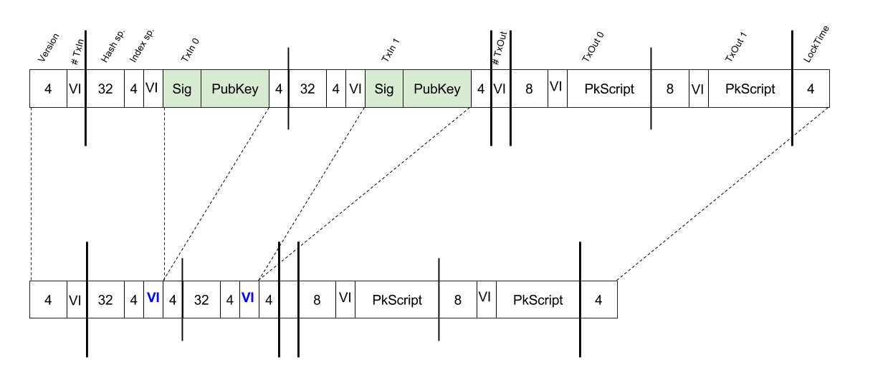
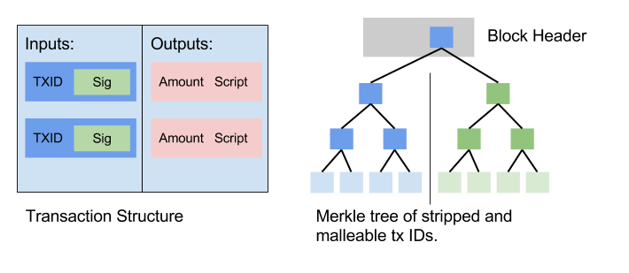

# Segregated Witness for Prova

When designing a new blockchain, the many lessons learned from Bitcoin over the last 8 years can be incorporated. The benefits introduced in the Segregated Witness (SegWit) proposal are examined in this design document and applied to the design of the Prova chain, while avoiding any compromises due to SegWit being deployed as a soft fork in Bitcoin.

## Segregated Witness Components

The Segregated Witness proposal consists of the following Bitcoin Improvement Proposals (BIP):

| Name  | Description |  Bitcoin chain | RMG chain |
| ------------- | ------------- | ------------- | ------------- |
| [BIP 0141](https://github.com/bitcoin/bips/blob/master/bip-0141.mediawiki) | SegWit Consensus layer  | BIP9 | Partially adopted |
| [BIP 0142](https://github.com/bitcoin/bips/blob/master/bip-0142.mediawiki) | Address Format | deferred | ignored |
| [BIP 0143](https://github.com/bitcoin/bips/blob/master/bip-0143.mediawiki) | Signature Verification | BIP9 | Partially adopted |
| [BIP 0144](https://github.com/bitcoin/bips/blob/master/bip-0144.mediawiki) | SegWit Peer Services | BIP9 | Not adopted |
| [BIP 0145](https://github.com/bitcoin/bips/blob/master/bip-0145.mediawiki) | getblocktemplate Updates | BIP9 | Not adopted |
| [BIP 0146](https://github.com/bitcoin/bips/blob/master/bip-0146.mediawiki) | signature encoding malleability | | |
| [BIP 0147](https://github.com/bitcoin/bips/blob/master/bip-0147.mediawiki) | dummy stack element malleability | BIP9 | Partially adopted |

**How Prova chain applies it:**

The improvements provided by SegWit which the Prova chain incorporates are:

1. Eliminate 3rd party malleability
2. Commit to input values (benefits hardware wallets)
3. Eliminate the O(N^2) hashing problem seen when validating signatures

SegWit also, by separating the signatures from the transaction itself, gives a clever way to increase the effective block space without doing a hard fork. We don’t care about this for Prova, and so, signatures will remain with the transactions themselves.

## Malleability Fixes

In Bitcoin, the transaction IDs are hashes of the entire transaction, including signatures. Unfortunately, ECDSA signatures, as encoded in transactions, allow anyone to make modifications to it (third-party malleability) that will not invalidate it, but will change the transaction ID. Because Transaction IDs are used in inputs of other transaction, dependent unconfirmed transactions become invalid if a malleated version of the original transaction is mined. SegWit proposes a new non-malleable transaction ID and a new structure to commit to transactions in the block header.

### Merkle Root

The Prova chain takes a similar approach to SegWit in Bitcoin. The Merkle root becomes the hash of the roots of 2 separate Merkle sub-trees.
The first tree commits to the Transaction IDs, while the second tree commits to the hashes of each transaction with the signatures included.



Figure 1 shows the serialized structure of a transaction and how scriptSigs (Sig and PubKey) are removed before the Transaction ID is calculated from the serialized transaction.

### Block Header Commitment in Bitcoin

SegWit extracts the signature information into a separate Merkle tree, which only nodes that want to validate the signatures need to be aware of. As both, stripped transaction IDs and conventional transaction IDs need to be committed to in the block header, this separate merkle tree is included through the coinbase transaction of the miner.

**How Prova chain does it:**

The Prova chain does not need to keep backwards compatibility, hence, it can commit to both Merkle trees directly in the header.



Figure 2 shows how the RMG chain constructs merkle trees of TxIDs and TxIDWithSigs and then combines the merkle trees by hashing both roots into a new root, which is written to the block header.

## Transaction Digest Algorithm

Before a transaction can be signed, it is serialized in a certain format and hashed. The data that is included in the serialization and the way hashing is applied are addressed by BIP 143.

### Signing of Input Values

BIP 143 defines a new transaction digest algorithm that commits to the values of the inputs. This way an offline air-gapped wallet can sign input values that it learned from an untrusted source. If the values are wrong, the tx is invalid, and no coins lost.

***How Prova chain does it:***

The Prova implementation adopts a modified version of the BIP 143 proposal for digests as follows:

```
Double SHA256 of the serialization of:
     1. nVersion of the transaction (4-byte little endian)
     2. hashPrevouts (32-byte hash)
     3. hashSequence (32-byte hash)
     4. outpoint (32-byte hash + 4-byte little endian)
    (removed -- 5. scriptCode of the input (serialized as scripts inside CTxOuts) --)
     6. value of the output spent by this input (8-byte little endian)
     7. nSequence of the input (4-byte little endian)
     8. hashOutputs (32-byte hash)
     9. nLocktime of the transaction (4-byte little endian)
    10. sighash type of the signature (4-byte little endian)
```

The serialization is as proposed, except the commitment to the input’s scriptCode. (TBD: We may add this back)

### Linear Scaling of Sighash Operations

The verification time of a block scales quadratically rather than linearly with the number of inputs to a Bitcoin transaction. This problem is addressed by the SegWit proposal in BIP 143.

SegWit applies a layered hashing method to different parts of the data so that each byte only needs to be hashed at most twice. This digest structure also allows to use hash caches, which reduces the complexity of verifying all transactions in a block to O(n).

**How Prova chain applies it:**

The Prova chain fully adopts this proposal and also employs hash caches for verification.
